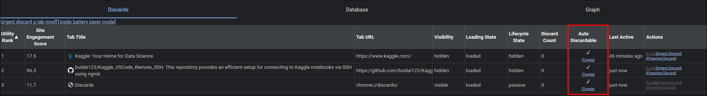

# Kaggle_VSCode_Remote_SSH

A way to ssh into Kaggle!

## Table of Contents

1. [SSH Setup](#ssh-setup)
   - [Step 1: Generate SSH Keys](#step-1-generate-ssh-keys)
   - [Step 2: Add SSH Public Key to GitHub](#step-2-add-ssh-public-key-to-github)
   - [Step 3: Get Ngrok Authtoken](#step-3-get-ngrok-authtoken)
2. [Using the SSH Setup on Kaggle](#using-the-ssh-setup-on-kaggle)
3. [Connect via SSH](#connect-via-ssh)
4. [Additional Information](#additional-information)
   - [Managing SSH Keys](#managing-ssh-keys)
   - [Troubleshooting](#troubleshooting)

## SSH Setup

> [!WARNING]
>
> Due to recent Ngrok policy changes, using its services might be limited:
>
> - TCP endpoints are only available on a free plan after [adding a valid payment method](https://dashboard.ngrok.com/settings#id-verification) to your account.
> - **Data Transfer Limits**: Free account are limited to 1GB data transfer.
>
> Otherwise checkout [zrok branch](https://github.com/buidai123/Kaggle_VSCode_Remote_SSH/tree/feat/zrok-integration) (offers same features with less limits and does not require CC)
>
> 

### Step 1: Generate SSH Keys

```sh
ssh-keygen -t rsa -b 4096 -C "kaggle_remote_ssh" -f ~/.ssh/kaggle_rsa
```

Follow the prompts. Save the keys in the location ~/.ssh/kaggle_rsa

### Step 2: Add the SSH Public Key to GitHub

```sh
cat ~/.ssh/kaggle_rsa.pub
```

Now you got the key pair, what you need to do now is pushing that key to whatever remote server allow us can fetch it(google drive, or github, gitlab, ...), here i use github

Create a new repo, copy `~/.ssh/kaggle_rsa.pub` to that repo and push it to github(remember to make a public repo), now the public key is available on github, you now need to head over to that repository and click to the public key you've pushed now you click to raw button at the top right and copy the url like the image blow


### Step 3: Get Ngrok Authtoken

1. Go to [Ngrok](https://ngrok.com) and sign in or create an account.
2. Navigate to the "Authtoken" section of the dashboard.
3. Copy your auth token.

## Setup on Kaggle

- Create a Kaggle notebook, choose your desired GPU, adjust persistence if needed, enable internet access.

- Run the following commands in a notebook cell:

```bash
!printenv > /kaggle/working/kaggle_env_vars.txt
!git clone https://github.com/buidai123/Kaggle_VSCode_Remote_SSH.git /kaggle/working/Kaggle_VSCode_Remote_SSH
%cd /kaggle/working/Kaggle_VSCode_Remote_SSH
!pip install -r requirements.txt
!chmod +x setup_kaggle_ssh.py setup_ssh.sh
!./setup_ssh.sh <your-public-key-link>
!python3 setup_kaggle_ssh.py <ngrok-auth-key>
```

- Wait until the setup is complete as shown in the image below.


> [!NOTE]
> i use password here as the fallback if the ssh key doesn't work properly so if you're using Linux you can ignore this password

## Connect via SSH

Install the required VSCode extensions.


Hit `ctrl` + `shift` + `p`, search for `Remote-SSH: Connect to Host` and choose `Configure SSH Hosts`


Select the first option or paste the path to your config file in the settings.


Update your `~/.ssh/config` file on your local machine with the connection details:

```plaintext
Host "Kaggle"
    HostName <hostname from script output>
    User root
    Port <port from script output>
    IdentityFile <path to your private key>
```


Save it and hit `ctrl` + `shift` + `p` again. Choose `Configure SSH Hosts`and select the host name you set earlier.


A new window will appear; if prompted for the OS, choose Linux, then continue and enter your password if required. That's it!

Note that the first time you connect if it said `could not connect...` then you need to empty your config file and this time choose `Add New SSH Host...` and paste this command in

```bash
ssh root@<HostName> -p <Port>
```

Replace `<HostName>` and `<Port>` like before

After connected go to /kaggle/working/ folder(you might want to work there). You can open terminal and run the following command to install necessary extension

```sh
    /kaggle/working/Kaggle_VSCode_Remote_SSH/install_extensions.sh
```

> [!TIP]
>
> 
>
> If you're using chromium base browser you can disable battery saver mode for the Kaggle tab by going to `chrome://discards` click to toggle to to disable auto discardable

## Additional Information

### Managing SSH Keys

- **Multiple Keys**: Store each key pair in separate files and configure SSH clients to use the appropriate key.
- **Security**: Secure your private keys and distribute only public keys.

### Troubleshooting

> [!IMPORTANT]
>
> **Remember to add a CC to your Ngork account first**

- **Connectivity Issues**: Ensure that your Kaggle Notebook is running and that the ngrok tunnel is active.
- **Permission Denied**: Verify permissions and paths to your SSH keys and ensure the public key is authorized in the Kaggle Notebook.

If you have any questions or need further assistance, feel free to reach out:

- Email: [ss1280dzzz@gmail.com](mailto:ss1280dzzz@gmail.com)
