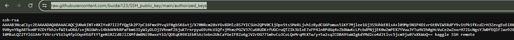
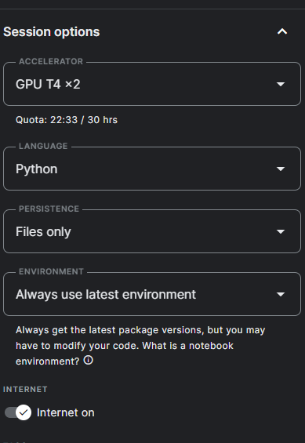
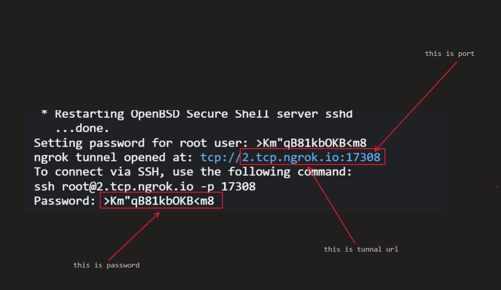
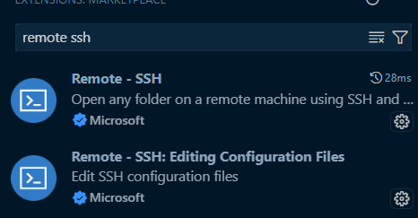
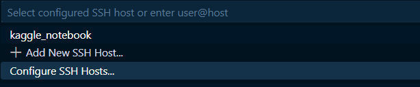
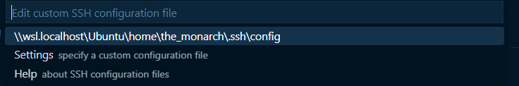
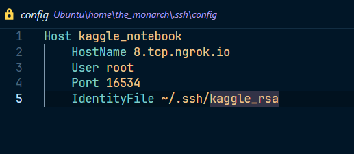
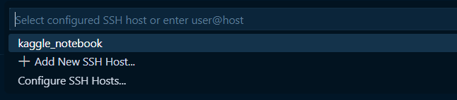

# Kaggle_VSCode_Remote_SSH
This repository provides an efficient setup for connecting to Kaggle notebooks via SSH using `ngrok`.
## Prerequisites

- Kaggle Notebook
- Ngrok account
- A public repository containing your `authorized_keys` file

## SSH Setup

### Step 1: Generate SSH Keys
1. Open your terminal.
2. Generate a new SSH key pair by running:
    here I'm using WSL or you can use Git Bash

    ```sh
    ssh-keygen -t rsa -b 4096 -C "kaggle_remote_ssh" -f ~/.ssh/kaggle_rsa
    ```
3. Follow the prompts. Save the keys in the location  ~/.ssh/kaggle_rsa

### Step 2: Add the SSH Public Key to GitHub

1. Locate your public key by running:

    ```sh
    cat ~/.ssh/kaggle_rsa
    ```

2. Copy the contents of the public key.
3. Go to [GitHub](https://github.com) and log in.
4. Create a new GitHub repository (e.g., `SSH_public_key`).
5. In the repository, create a file named `authorized_keys` and paste your SSH public key into this file.
6. Save and commit the file.
7. Click to `authorized_keys` file then click to `raw` then copy the url like this



### Step 3: Get Ngrok Authtoken

1. Go to [Ngrok](https://ngrok.com) and sign in or create an account.
2. Navigate to the "Auth" section of the dashboard.
3. Copy your auth token.


## Using the SSH Setup on Kaggle



Create a Kaggle notebook, choose your desired GPU, adjust persistence if needed, enable internet access, and run the following commands in a notebook cell:
```bash
%%bash
# Use this to ensure the output from Python is not buffered
# export PYTHONUNBUFFERED=1

# Step 1: Clone the repository, install requirements, and set permissions
git clone https://github.com/buidai123/Kaggle_VSCode_Remote_SSH.git /kaggle/working/Kaggle_VSCode_Remote_SSH

cd /kaggle/working/Kaggle_VSCode_Remote_SSH

pip install -r requirements.txt

chmod +x setup_kaggle_ssh.py
chmod +x setup_ssh.sh

# Step 2: Run the SSH setup
./setup_ssh.sh <your_authorized_key_repo>

# Step 3: Run the ngrok setup with Python
python3 setup_kaggle_ssh.py <you_authtoken>
```
Wait until the setup is complete as shown in the image below.




## Connect via SSH

In Vscode install these two extensions




Then hit `ctrl` + `shift` + `p`, search for `Remote-SSH: Connect to Host` and choose `Configure SSH Hosts`



Select the first option or paste the path to your config file in the settings.



Update your `~/.ssh/config` file on your local machine with the connection details:

```plaintext
Host kaggle-notebook
    HostName <hostname from script output>
    User root
    Port <port from script output>
    IdentityFile <path to your private key>
```



Save it and hit `ctrl` + `shift` + `p` again. Choose `Configure SSH Hosts`and select the host name you set earlier.



A new window will appear; if prompted for the OS, choose Linux, then continue and enter your password if required. That's it!

## Additional Information

### Managing SSH Keys

- **Multiple Keys**: If you need to manage multiple SSH keys, ensure each key pair is stored in a separate file, and configure the SSH client to use the appropriate key for each connection.
- **Security**: Keep your private keys secure and never share them. Only the public key should be distributed.

### Troubleshooting

- **Connectivity Issues**: Ensure that your Kaggle Notebook is running and that the ngrok tunnel is active.
- **Permission Denied**: Double-check the permissions and paths to your SSH keys. Ensure the public key is correctly added to GitHub and authorized in the Kaggle Notebook.

## Contribution

Contributions are welcome! If you find any issues or have suggestions for improvements, please open an issue or create a pull request.

## Contact

If you have any questions or need further assistance, feel free to reach out:

- Email: [ss1280dzzz@gmail.com](mailto:ss1280dzzz@gmail.com)

For more details or issues, refer to the GitHub issues page or contact us.

## License

This project is licensed under the Apache-2.0 License - see the [LICENSE](LICENSE) file for details.